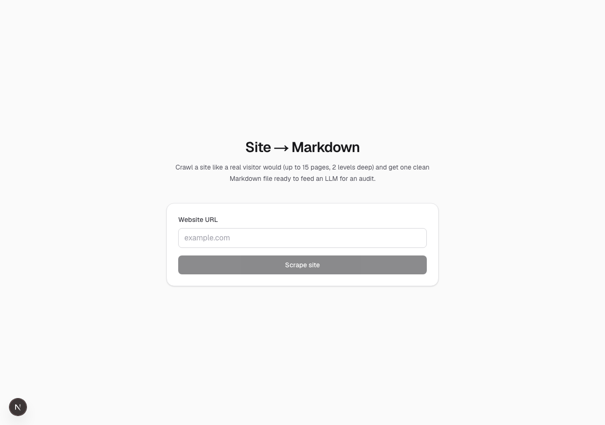

# day-02-webscraper

Drop in a URL, get a single Markdown file containing the site's main pages — designed for uploading into an LLM for a marketing or SEO audit.



Day 02 of the [100 Day AI Build Challenge](https://www.100dayaichallenge.com/share/savion) — one new app every day for 100 days.

## What it does

Paste a website URL → Playwright launches headless Chromium → BFS-crawls up to 15 pages (depth 2 from the homepage, same-origin only, sitemap as a fallback) → each page is rendered the way a real visitor would see it, then run through [Mozilla Readability](https://github.com/mozilla/readability) + [Turndown](https://github.com/mixmark-io/turndown) → everything concatenates into one `[hostname].md` with a per-page header block (URL, title, meta description, H1, word count) followed by clean Markdown body content.

The output is sized and structured for one job: a marketer uploads the file into ChatGPT / Claude / Gemini and asks for a messaging audit, SEO review, or copy critique without having to copy-paste pages one at a time.

## Quick start

```bash
git clone https://github.com/Still-InFrame/day-02-webscraper.git
cd day-02-webscraper
npm install
npx playwright install chromium
npm run dev
```

Open http://localhost:3000, drop in a URL, wait 30–120 seconds, click **Open in Finder**. The `.md` file lives in `scrapes/[hostname].md`.

## Design choices

A few intentional decisions:

- **BFS from the homepage, not sitemap-first.** A `sitemap.xml` is often a dump of hundreds of blog posts and legacy URLs. For a marketing audit, the 15 pages a visitor actually reaches matter more. The sitemap is only used when the homepage exposes no internal links.
- **Playwright over fetch + cheerio.** Slower and heavier, but it renders SPAs and JS-hydrated content the way a real visitor sees it. Cheerio would miss most of a modern React/Vue site.
- **Serial crawl, not parallel.** 15 pages serially takes ~30–120 seconds depending on the site. Parallelism would shave time but complicates politeness and error handling — not worth it at this scale.
- **Localhost only, no deploy.** Playwright on serverless platforms is painful (huge cold starts, Chromium binary size, vendor-specific workarounds). Running on your own machine is just easier.

## Tech stack

- **Next.js 16** (App Router, Turbopack) + **React 19** + **TypeScript**
- **Tailwind CSS v4**
- **Playwright** (headless Chromium)
- **@mozilla/readability** + **jsdom** for main-content extraction
- **Turndown** for HTML → Markdown
- **zod** for request validation
